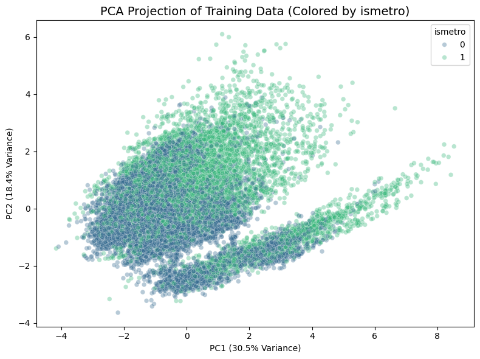
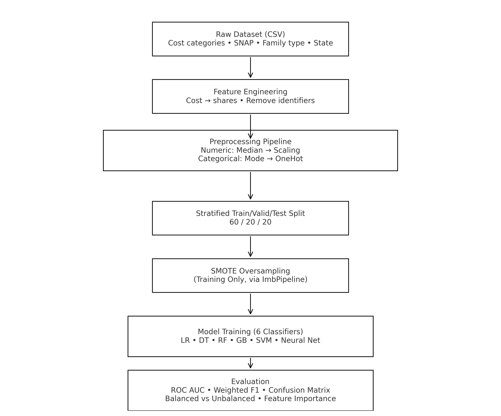

# Predicting Metropolitan Status from Structural Cost Shares Using Machine Learning

This repository contains the full implementation, analysis, and research paper for a machine learning study investigating whether U.S. county metropolitan status can be predicted solely from structural household expenditure shares and minimal demographic indicators. The research demonstrates that cost-share compositions encode strong geographic and socioeconomic signals, enabling accurate metro classification even when explicit geographic identifiers are missing.

---

## Project Overview

The central research question is:

**Can structural cost-share patterns alone reliably classify counties as metropolitan or non-metropolitan?**

To answer this, the project uses normalized expenditure shares for:
- Housing  
- Transportation  
- Healthcare  
- Food  
- Childcare  
- Taxes  
- Other necessities  

Along with:
- SNAP participation rate  
- Family type  
- State abbreviation  

A complete machine-learning pipeline was constructed, including:
- Feature normalization and engineering  
- Imputation, scaling, and one-hot encoding using a unified preprocessing pipeline  
- SMOTE oversampling for class balance  
- PCA for structural dimensionality analysis  
- Comparative evaluation of six classifiers  
- Aggregated feature importance across model families  

The best-performing model, a Neural Network (MLP), achieved:

- **Test ROC AUC:** 0.9528  
- **Test Weighted F1 Score:** 0.8864  

These results confirm that cost-share structures alone provide a strong and interpretable signal of metropolitan economic conditions.

---

## Visual Summary

### PCA Projection of Cost-Share Features
This plot shows how counties cluster in PCA space using only structural expenditure shares and minimal demographic inputs. Metro and non-metro counties form partially separable clusters along PC1, reflecting underlying urban–rural cost gradients.

---

### Machine Learning Pipeline Diagram
The full modeling workflow, from preprocessing through evaluation.

-- 

## Repository Structure

📁 project-folder
│
├── 📄 metro_classification.ipynb
│      └─ Full analysis: EDA, PCA, modeling pipeline, evaluation
│
├── 📄 metro_status_paper.pdf
│      └─ Final IEEE-style research paper
│
├── 📄 README.md
│      └─ Project overview and documentation
│
└── 📁 data
       └── data.csv   # County-level cost-share and demographic dataset

---

## Methods Summary

### Preprocessing Pipeline
A unified preprocessing pipeline was implemented using:

- Median imputation for numeric variables  
- Standardization via `StandardScaler`  
- Most-frequent imputation for categorical variables  
- One-hot encoding with `handle_unknown='ignore'`  

This ensures consistent, leakage-free transformations across all models.

### Models Evaluated
A diverse set of classifiers was compared:

- Logistic Regression  
- Decision Tree  
- Random Forest  
- Gradient Boosting  
- Support Vector Classifier  
- Neural Network (MLP)  

### Handling Class Imbalance  
SMOTE oversampling was applied inside an `ImbPipeline` to ensure oversampling occurred only on training folds, preserving the integrity of validation and test sets.

### Evaluation Metrics  
The models were compared using:

- ROC AUC (primary metric)  
- Weighted F1 score  
- Confusion matrix  
- Balanced vs. unbalanced performance comparison  
- Combined feature importance across three model families  

### Validation Results

| Rank | Model                     | Validation F1 | Validation ROC AUC |
|------|---------------------------|---------------|---------------------|
| 1    | NeuralNet (Unbalanced)    | **0.8908**    | **0.9541**          |
| 2    | NeuralNet (Balanced)      | 0.8849        | 0.9525              |
| 3    | SVC (Unbalanced)          | 0.8732        | 0.9291              |
| 4    | RandomForest (Balanced)   | 0.8414        | 0.9152              |
| 5    | RandomForest (Unbalanced) | 0.8293        | 0.9120              |
| 6    | GradientBoosting (Balanced)| 0.8217       | 0.8889              |
| 7    | GradientBoosting (Unbalanced)| 0.8156     | 0.8851              |
| 8    | LogReg (Balanced)         | 0.8157        | 0.8776              |
| 9    | LogReg (Unbalanced)       | 0.8221        | 0.8770              |
| 10   | DecisionTree (Balanced)   | 0.8107        | 0.8204              |
| 11   | DecisionTree (Unbalanced) | 0.8146        | 0.8093              |

---

## Key Findings

- Structural expenditure shares convey rich socioeconomic information that aligns closely with metro–non-metro distinctions.
- Housing and other-necessities shares were the strongest positive predictors of metro status.
- Transportation and healthcare shares were the strongest negative predictors.
- PCA revealed clear clustering structure aligned with metropolitan status, despite no geographic inputs.
- Neural Networks provided the most accurate and generalizable decision boundary across nonlinear feature interactions.
- The final test performance confirms strong predictive capability in unseen county data.

---

## How to Use This Repository

### 1. Open the Notebook
Run the complete analysis using:

metro_classification.ipynb

It includes:

- Data loading  
- Feature engineering  
- Exploratory data analysis  
- PCA projection  
- Model training and validation  
- SMOTE balancing  
- Final model evaluation  
- Confusion matrix and ROC curve  

### 2. View the Research Paper
The report is available here:

metro_status_paper.pdf

This document contains full methodological detail, figures, analysis, interpretation, discussion, and references.

---

## Citation

If you use or reference this project, please cite:

M. J. Mungoshi, "Predicting Metropolitan Status from Structural Cost Shares Using Machine Learning,"
Clarkson University, 2025.

---

## Author

**Mutsa Jonah Mungoshi**  
Applied Data Science  
Clarkson University  
Email: mungosmj@clarkson.edu
